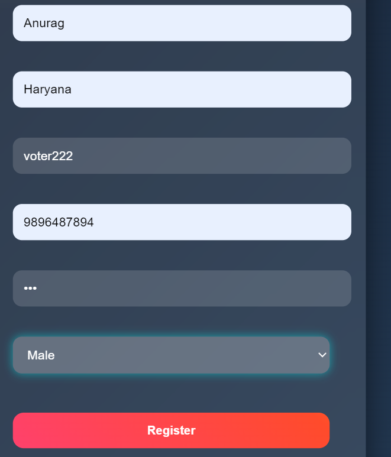
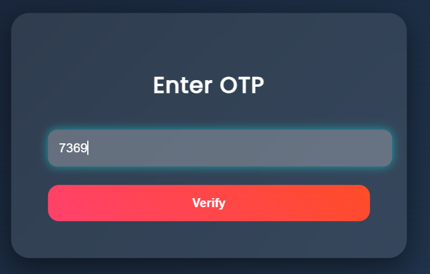
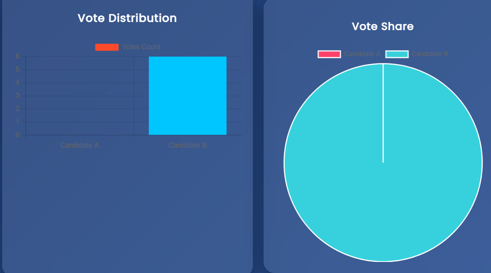

# Secure Voting System

## Overview

A Secure Voting System developed using Flask, SQLite and Paillier Homomorphic Encryption.

This project demonstrates secure online voting using authentication, OTP verification, vote management and result analytics.

---

## Features

- User Registration
- Login Authentication
- OTP Verification
- Secure Voting
- Admin Dashboard
- Result Visualization
- Gender Based Analysis
- Paillier Cryptosystem Integration

---

## Technology Stack

- Python
- Flask
- SQLite
- HTML
- CSS
- JavaScript
- Chart.js
- Paillier Cryptography

---

## Project Structure

```text
Secure_Voting_system
│
├── app.py
├── database.db
├── static
├── templates
├── screenshots
└── README.md
```

---

## Screenshots

### Registration Page



### Login Page


### OTP Verification



### Voting Page


### Admin Dashboard


### Result Dashboard



---
